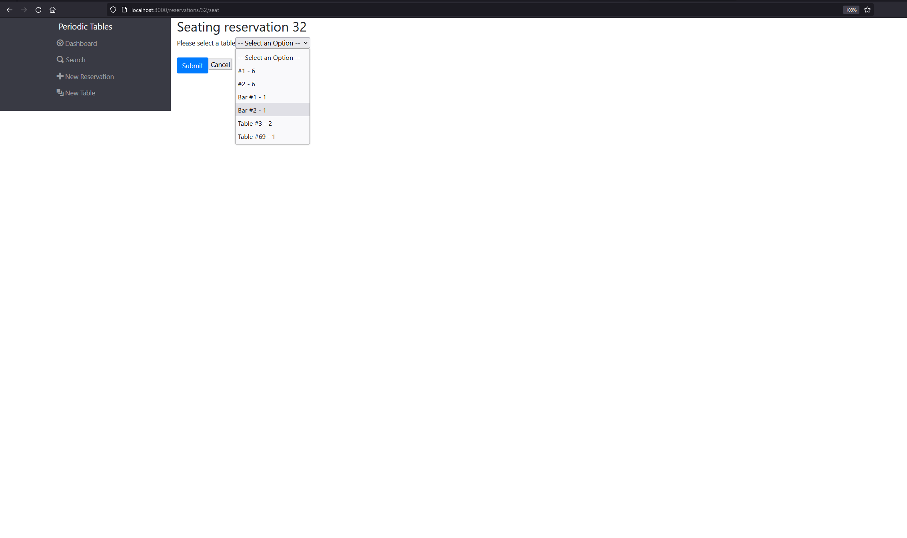

# Periodic Tables Restraunt Reservation Application

Live Application: https://periodic-tables-capstone-frontend.onrender.com

This appliction allows users to manage reservations at a restraunt and stores data persitently in a SQL database

## Installation

1. Fork and clone this repository.
1. Run `cp ./back-end/.env.sample ./back-end/.env`.
1. Update the `./back-end/.env` file with the connection URL's to your ElephantSQL database instance.
1. Run `cp ./front-end/.env.sample ./front-end/.env`.
1. You should not need to make changes to the `./front-end/.env` file unless you want to connect to a backend at a location other than `http://localhost:5001`.
1. Run `npm install` to install project dependencies.
1. Run `npm run start:dev` to start your server in development mode.

*API Documentation*

There are 2 main routes for the API: `/reservations` and `/tables`

### Reservations

`/reservations` responds to GET and POST requests

GET will list all reservations. Optional query params are `?date` and `?mobile-number`

POST allows creation of a new reservation. POST requests must be JSON with the following format (null values not allowed):
```json
{
    "data": {
        "first_name": "First",
        "last_name": "Name",
        "mobile_number": "123-456-7890",
        "reservation_date": "2023-05-31",
        "reservation_time": "10:00",
        "people": 1
    }
}
```
`/reservations/:reservation_id` allows GET and PUT

GET reads a single reservation for the given ID

PUT updates a single reservation. The request body must be in valid format

`/reservations/reservation_id/status` allows PUT request. Updates the status property of the given reservation
the request must be JSON in the following format:
```json
{
  "data": { "status": "seated" } 
}
```

### Tables

`/tables` responds to GET and POST requests

GET will list all tables and POST creates a table. The new table must be JSON in the following format:

```json
{
  "data": {
    "table_name": "Table 1",
    "capacity": 2
  }
}
```
`/tables/table_id/seat` allows PUT and DELETE 
PUT requires a JSON object and sets the table's `reservation_id` to the given reservation_id
```json
{ "data": { "reservation_id": 1 } }
```
DELETE sets the `reservation_id` for the given table to `null`

The dashboard page displays a list of all tables and all reservations for a given date (eg /dashboard?date=2023-31-05) if no date is given the date will be today
The side nav bar allows navigation to pages for creating or searching reservations and creating a new table


Search allows you to search reservations by phone number


Form for creating reservations


Form for creating tables


Seating a reservation at a table



